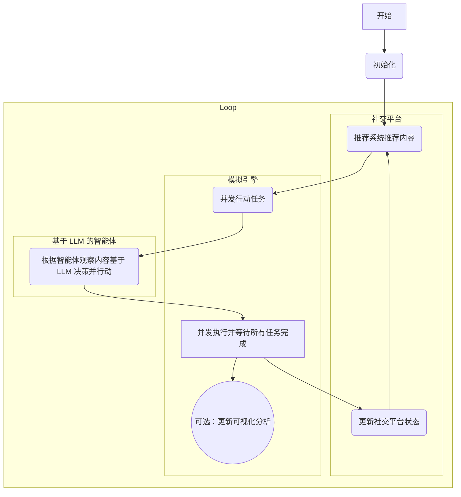

# SoNetSim 项目报告

## 简介

SoNetSim 是一个社交网络模拟器（Social Network
Simulator），它利用了大型语言模型智能体（Large Language Model
Agent）来模拟社交媒体平台上的用户行为，为研究社交网络的动态行为提供了基础。

## 架构

该模拟器由三个主要部分组成：

1. **模拟引擎**: 模拟器的核心，负责管理模拟时间、协调智能体行为并更新社交网络的状态。它基于 Python 的
   `asyncio` 库构建，以高效地处理并发的智能体行为。
2. **基于 LLM 的智能体**: 社交网络中的每个用户都由一个大型语言模型驱动的智能体表示。这些智能体可以执行各种操作，例如创建帖子、转发、点赞和关注其他用户。智能体的行为由其个人资料和从平台接收到的信息驱动。
3. **社交平台**: 该组件模拟社交媒体平台本身。它管理用户帐户、社交关系和信息流。它还包括一个可以配置为使用不同算法的推荐系统。

在每个时间步中，模拟器的核心循环按以下顺序执行，各组件协同工作：

1.  **社交平台更新推荐**：平台为所有用户异步更新其信息流中的推荐内容。
2.  **模拟引擎创建行动任务**：引擎为每个智能体创建一个并发的行动任务。
3.  **基于 LLM 的智能体决策与行动**：每个智能体根据其观察到的信息（如推荐内容），利用大语言模型（LLM）进行决策并执行相应的行动（如发帖、点赞等）。
4.  **模拟引擎并发执行**：引擎并发处理所有智能体的决策和行动。这模拟了真实世界中用户行为的并行性，并显著提高了模拟效率。
5.  **社交平台更新状态**：在所有智能体完成行动后，平台会根据这些行动更新其内部状态，例如社交图谱、帖子状态等。
6.  **可视化分析**：在当前时间步的所有行动完成后，系统会捕捉并保存社交网络图的快照，用于后续的可视化分析。

这个循环会持续进行，直到达到预设的模拟步数，从而驱动整个社交网络的动态演化。

## 核心功能

- **异步并发执行**: 模拟器采用异步并发执行，从而提高模拟效率。
- **基于多智能体的模拟**: 模拟器采用多智能体方法，其中每个智能体都是具有自身目标和行为的自治实体。
- **LLM 驱动的行为**: 与传统的基于规则的模型相比，使用大型语言模型可以实现更真实、更复杂的用户行为。
- **社交平台基础设施**: 支持不同类型社交平台（例如 Twitter、Reddit 等）的基础设置，包括多样的动作空间、基于神经网络模型的推荐系统等。
- **可视化分析**: 可以生成并可视化随时间演变的社交图谱与趋势图，从而提供对传播动态的见解。

## 实现细节

本项目基于 Python 开发，具体技术栈如下：

- 后端:
  - 社交平台基础设施：`oasis`
  - 大型语言模型集成：`camel`
  - 异步执行：`asyncio`
  - 数据处理：`pandas`
  - 数据库：`sqlite3`
- 前端:
  - 网页: `streamlit`
  - 可视化:
    - `plotly`：趋势图
    - `pyvis`：社交网络图

## 效果测评

为了测试 SoNetSim 项目是否能为用户挑选更受欢迎的推文，我们根据人类偏好，构建了一系列 <更受欢迎的推文，不受欢迎的推文> 数据对，保持其他条件相同，使用  SoNetSim 来模拟两种推文的传播效果，下面是一些示例。

### 场景一：推销新歌

|        | 受欢迎的推文                                                 | 不受欢迎的推文                                               | $\Delta$ |
| ------ | ------------------------------------------------------------ | ------------------------------------------------------------ | -------- |
|        | Hey everyone! 🎶 Excited to share my new song "Dream Chaser"! 🚀 It's a journey of hope and perseverance. Give it a listen and let me know what you think! #NewSong #Music #SupportLocalArtists | Just putting my new song out there. It's okay, I guess. If you want to listen, the link is below. No pressure. #Music #NewSong |          |
| Follow | 31                                                           | 22                                                           | +8       |
| Like   | 8                                                            | 4                                                            | +4       |
| Repost | 33                                                           | 26                                                           | +7       |

### 场景二：讨论游戏

|        | 受欢迎的推文                                                 | 不受欢迎的推文                                      | $\Delta$ |
| ------ | ------------------------------------------------------------ | --------------------------------------------------- | -------- |
|        | Just finished playing Minecraft and I'm blown away! 🎮 The graphics are stunning, and the storyline is super engaging. Can't wait to see what happens next! What do you guys think? #Gaming #GameReview #BestGameEver | Played Minecraft today. It was okay. Not bad. #Game |          |
| Follow | 53                                                           | 53                                                  | 0        |
| Like   | 340                                                          | 334                                                 | +6       |
| Repost | 272                                                          | 270                                                 | +2       |

### 场景三：医疗问题

|        | 受欢迎的推文                                                 | 不受欢迎的推文                                               | $\Delta$ |
| ------ | ------------------------------------------------------------ | ------------------------------------------------------------ | -------- |
|        | Just read an amazing article about the latest breakthroughs in cancer treatment! 🌟 The advancements in immunotherapy are giving so much hope to patients and their families. Let's spread awareness and support research! #CancerAwareness #MedicalBreakthrough #Health | I don't get why people are so worried about vaccines. They're fine. #Medical |          |
| Follow | 129                                                          | 130                                                          | -1       |
| Like   | 325                                                          | 313                                                          | +12      |
| Repost | 267                                                          | 251                                                          | +16      |

### 场景四：新品运动鞋发布

|        | 受欢迎的推文                                                 | 不受欢迎的推文                                         | $\Delta$ |
| ------ | ------------------------------------------------------------ | ------------------------------------------------------ | -------- |
|        | 👟💥 New Arrival Alert! 🔥 Just dropped: Our latest sneaker masterpiece! ✨ Ultra-lightweight design ✨ High-performance cushioning ✨ Limited edition colors Get yours now! Only a few pairs left! #SneakerHeads #LimitedEdition #NewRelease | We have a new sneaker. It’s pretty good. #NewShoes |          |
| Follow | 395                                                          | 394                                                    | +1       |
| Like   | 452                                                          | 456                                                    | -4       |
| Repost | 368                                                          | 338                                                    | +30      |

### 场景五：饮品推荐

|        | 受欢迎的推文                                                 | 不受欢迎的推文                        | $\Delta$ |
| ------ | ------------------------------------------------------------ | ------------------------------------- | -------- |
|        | Summer Refresh Alert! 🌞 New Iced Tea is here! 🍃 Sweet, tangy, and perfect for the heat! Grab yours today! 🥤 #SummerCool #IcedTea #Refreshment | We have iced tea. It’s good. #Tea |          |
| Follow | 180                                                          | 179                                   | +1       |
| Like   | 151                                                          | 152                                   | -1       |
| Repost | 127                                                          | 117                                   | +10      |

可以看出，五个场景中人类认为的更受欢迎推文在我们的社交软件模拟器上都获得了更广泛的传播（$\Delta$ 基本为正值），这验证了我们的社交软件模拟器的有效性。

## 人员分工

- **童雨轩**: 架构设计、模拟器开发、数据收集、可视化分析
- **朱志杭**: 前端逻辑、可视化分析
- **范孙奇**: 数据收集、模型评测
